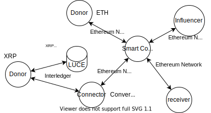

# Setting Up LUCE, Ganache, and Interledger for Philanthropy Project
* [Introduction](#introduction)
* [Prerequsites](#prerequsites)

## Introduction
This work contains the instructions to setup an environment for the phylanthropy project (the project that is part of the [York-Maastricht Partnership](https://www.york.ac.uk/global/globalpartnerships/york-maastricht/)). The project allows donors to donate money not only in Ethereum (ETH) but also in other cryptocurrencies, e.g., Ripple (XRP), via the **Interlederger** platform (a multicurrency payment infrastructure). Also, campaign agreements between influencers and beneficiaries are manifested in the form of smart contracts managed by **LUCE** (a smart contract management platform). All donation transactions are recorded in Ethereum blockchain to deliver transparancy. The illustration below is the architecture.



The following instructions show you how to setup **LUCE** (a smart contract management platform) and **Interledger** (a multicurrency payment infrastructure) so that they can run in the same **Ganache** testnet (an Ethereum test network). 
This setup allows LUCE:
1. to deploy smart contracts on the Ganache testnet and also 
2. to send money via the Interledger from ETH (Ethereum) to XRP (Ripple)
3. using the same accounts automatically generated by the Ganache testnet.

The final network configuration is in the figure below.


This setup uses the Vagrant version of LUCE which can be found [here](https://github.com/arnoan/LUCE) and the basic Interledger network presented [here](https://interledger.org/developer-tools/get-started/spin-up/).

## Prerequsites
1. Vagrant requries [Virtual Box](https://www.virtualbox.org/). Therefore, we should install it first. 
    ```
    sudo apt update
    sudo apt install virtualbox
    ```
2. Then, install [Vagrant](https://www.vagrantup.com/).
    ```
    sudo apt install vagrant
    ```
3. `Node.js` and `npm` to run and install `ganache-cli`.
    ```
    sudo apt install nodejs npm
    ```
4. Interledger requires `docker`. Follow the instructions [here](https://docs.docker.com/engine/install/ubuntu/) to install `docker`. 

## 1. Setting Up Ganache-Cli
We will use Ganache-Cli as an external process, so it will **not** start with the Vagrant version of LUCE. Do to do so, install Ganache with the following command:
```
sudo npm install -g ganache-cli
```
Execute the command below to run the Ganache network. 
```
ganache-cli --mnemonic luce --db ~/.ganache_db --networkId 72 --host 0.0.0.0 --accounts 3 --defaultBalanceEther 1000000
```
The parameters are the parameters used by the Vagrant LUCE. The difference is we only start Ganache outside of the Vagrant LUCE.

Also notice that when running the code, `ganache-cli` also prints **the privates keys** of the 3 automatically-generated accounts. **The first two private keys** will be used in the following Interledger network setup as the private keys of Alice and Bob's Ethereum settlement engines.

## 2. Setting Up LUCE
Basically, to install LUCE, the instruction is similar to the instruction presented [here]([https://link](https://github.com/arnoan/LUCE)), execept that we need to comment some lines that start Ganache network so it will not start when Vagrant LUCE starts. We want to start Ganache network as a separate process, detached from the Vagrant LUCE process, so that it can be accessed as well by Interleger or other external programs. 

Execute these commands to download LUCE:
```
cd ~/path/to/desired/location/
git clone https://github.com/arnoan/LUCE.git
```
Edit the Vagrantfile using any texteditor. Here I use `gedit`:
```
cd ./LUCE/luce_vm 
gedit Vagrantfile
```
Comment (adding `#` at the front of) the line below and save the file to turn off port mapping of Ganache in Vagrant LUCE:
```
# lucevm.vm.network :forwarded_port, guest: 8545, host: 8545
```
Change directory to `script`:
```
cd script
```
Edit the start_servers.sh:
```
gedit start_servers.sh
```
Comment the line below and save the file so that Ganache will not start when LUCE starts.
```
#tmux send-keys -t jupyter_ganache_django.1 'ganache-cli --mnemonic luce --db ~/.ganache_db --networkId 72 --host 0.0.0.0 --accounts 3 --defaultBalanceEther 1000000' ENTER
```
Also replace all the `127.0.0.1:8545` ip addresses in files `/home/ryan/LUCE/luce_vm/luce_django/django_binary_db_field/utils/web3_scripts.py` and `/home/ryan/LUCE/luce_vm/luce_django/luce/utils/web3_scripts.py` with `192.168.0.4:8545`, which is the ip address of the host/local machine where the `ganache-cli` runs.

Go back to `luce_vm` directory and starts LUCE using these commands:
```
cd ..
vagrant up # start LuceVM
```
After that, go back to the `script` directory and then start all servers using the following commands:
```
cd script 
vagrant ssh -c 'bash start_servers.sh' 	# start the servers
```
#### Veryfying LUCE and Ganache have been installed properly
We can verify if LUCE and Ganache have installed properly by deploying a smart contract to the ganache network from the LUCE platform. 

Use any web browers to open page [http://127.0.0.1:8888](http://127.0.0.1:8888). Login with password 'luce'. Open the Python notebook file `2) hello_luce.ipynb`. Scroll down. Go to the Deploy section. Replace the ip `127.0.0.1` with your host/local ip or the ip address of the machine where the Ganache-cli runs. Try to run all the steps, or restart the kernel, and re-run the whole notebook. These steps will install the smart contract to the Ganache testnet. You can check the ETH balance of the first account that was automatically generated by Ganache when starting it. It should be reduced. 

Also, visit [http://127.0.0.1:8000](http://127.0.0.1:8000) in your browser to access the LUCE Data Exchange. Login with demo accounts, provider (username: provider@luce.com, password: provider) and requester (username: requester@luce.com, password: requester).

## 3. Setting Up Interledger
**The complete script to setup the Interledger network is under the `interledger` directory, file `ilp_luce_ganache_vagrant.sh`.** Make sure that `docker` has been installed. 

### Download Docker images
Run the command below to download docker images required by to create a basic Interledger network.
```
docker pull interledgerrs/ilp-node
docker pull interledgerrs/ilp-cli
# docker pull interledgerrs/ilp-settlement-ethereum
docker pull trufflesuite/ganache-cli
docker pull interledgerjs/settlement-xrp
docker pull redis
```
The `docker pull interledgerrs/ilp-settlement-ethereum` is commented since we are going to use the forked version of the settlement engine. The forked version allows us to supply a smart contract address so that money can be transferred directly to the smart contract, not to an Ethereum account. To install the forked version, follow the intruction provided here [forked ilp-settlement-ethereum](https://github.com/alfa-yohannis/settlement-engines).

### Create Local-ilp Network
Run the commands below to create all the required nodes in the network. Notice that in both settlement nodes, `alice-eth` and `bob-eth`, their **private keys** are the **same** as the private keys of **the first two accounts** that was automatically generated by Ganache-cli. 

**Notice** that Alice's settlement engine is started with a parameter `--contract_address 0x50Dd787a2768E0a5cbB057b94ee1cfEAf84556E5` which is the address of the smart contract that will receive money from the Interledger. An example of a smart contract that can receive ETH is under directory `smart_contract`. Make sure such smart contract has been deployed before testing.

***Remember to replace the all the `192.168.0.4` ip addresses below with the host/local machine's ip address.*** 
```
docker network create local-ilp

docker run -d \
  --name redis \
  --network local-ilp \
  redis
  
docker run -d \
  --name alice-eth \
  --network local-ilp \
  -e "RUST_LOG=interledger=trace" \
  interledgerrs/ilp-settlement-ethereum \
  --private_key 4a2cb86c7d3663abebf7ab86a6ddc3900aee399750f35e65a44ecf843ec39116 \
  --confirmations 0 \
  --poll_frequency 1000 \
  --ethereum_url http://192.168.0.4:8545 \
  --connector_url http://alice-node:7771 \
  --redis_url redis://redis:6379/0 \
  --asset_scale 18 \
  --settlement_api_bind_address 0.0.0.0:3000 \
  --watch_incoming \
  --contract_address 0x50Dd787a2768E0a5cbB057b94ee1cfEAf84556E5

docker run -d \
  --name alice-node \
  --network local-ilp \
  -e "RUST_LOG=interledger=trace" \
  interledgerrs/ilp-node \
  --ilp_address example.alice \
  --secret_seed 8852500887504328225458511465394229327394647958135038836332350604 \
  --admin_auth_token hi_alice \
  --redis_url redis://redis:6379/1 \
  --http_bind_address 0.0.0.0:7770 \
  --settlement_api_bind_address 0.0.0.0:7771 \
  --exchange_rate.provider CoinCap

docker run -d \
  --name bob-eth \
  --network local-ilp \
  -e "RUST_LOG=interledger=trace" \
  interledgerrs/ilp-settlement-ethereum \
  --private_key eeed5b1fc503bd2d9ea7cd2098794bcd4ee9c2f3a07ccab3401a263e02c36f71 \
  --confirmations 0 \
  --poll_frequency 1000 \
  --ethereum_url http://192.168.0.4:8545 \
  --connector_url http://bob-node:7771 \
  --redis_url redis://redis:6379/2 \
  --asset_scale 18 \
  --settlement_api_bind_address 0.0.0.0:3000 \
  --watch_incoming

docker run -d \
  --name bob-xrp \
  --network local-ilp \
  -e "DEBUG=settlement*" \
  -e "CONNECTOR_URL=http://bob-node:7771" \
  -e "REDIS_URI=redis://redis:6379/3" \
  -e "ENGINE_PORT=3001" \
  -e "XRP_SECRET=sny8ne9UkMFWA184Lifn1VVFdqrHp" \
  interledgerjs/settlement-xrp

docker run -d \
  --name bob-node \
  --network local-ilp \
  -e "RUST_LOG=interledger=trace" \
  interledgerrs/ilp-node \
  --ilp_address example.bob \
  --secret_seed 1604966725982139900555208458637022875563691455429373719368053354 \
  --admin_auth_token hi_bob \
  --redis_url redis://redis:6379/4 \
  --http_bind_address 0.0.0.0:7770 \
  --settlement_api_bind_address 0.0.0.0:7771 \
  --exchange_rate.provider CoinCap

docker run -d \
  --name charlie-xrp \
  --network local-ilp \
  -e "DEBUG=settlement*" \
  -e "CONNECTOR_URL=http://charlie-node:7771" \
  -e "REDIS_URI=redis://redis:6379/5" \
  -e "ENGINE_PORT=3000" \
  -e "XRP_SECRET=sasPP9PiLPATNRhjSx7rBc4yfRYNw" \
  interledgerjs/settlement-xrp

docker run -d \
  --name charlie-node \
  --network local-ilp \
  -e "RUST_LOG=interledger=trace" \
  interledgerrs/ilp-node \
  --secret_seed 1232362131122139900555208458637022875563691455429373719368053354 \
  --admin_auth_token hi_charlie \
  --redis_url redis://redis:6379/6 \
  --http_bind_address 0.0.0.0:7770 \
  --settlement_api_bind_address 0.0.0.0:7771 \
  --exchange_rate.provider CoinCap
```
The private keys of the XRP accounts used in the XRP settlement egines can be generated [here](https://xrpl.org/xrp-testnet-faucet.html). There are mini programs under the `xrp` directory that can be used to get the info and address of an XRP account. 

To improve debugging, you could also run every command of each container above on a separate console terminal and replace the paramater `-d` with `-i`. This ensures each container runs in interactive mode which means debug messages are displayed on the teminals. Ensure that the container is not already running when executing it.

### Create Interledger Accounts
Next is to create the accounts needed.
```
alias   alice-cli="sudo docker run --rm --network local-ilp interledgerrs/ilp-cli --node http://alice-node:7770"
alias     bob-cli="sudo docker run --rm --network local-ilp interledgerrs/ilp-cli --node http://bob-node:7770"
alias charlie-cli="sudo docker run --rm --network local-ilp interledgerrs/ilp-cli --node http://charlie-node:7770"

alice-cli accounts create alice \
  --auth hi_alice \
  --ilp-address example.alice \
  --asset-code ETH \
  --asset-scale 18 \
  --ilp-over-http-incoming-token alice_password

alice-cli accounts create bob \
  --auth hi_alice \
  --ilp-address example.bob \
  --asset-code ETH \
  --asset-scale 18 \
  --settlement-engine-url http://alice-eth:3000 \
  --ilp-over-http-incoming-token bob_password \
  --ilp-over-http-outgoing-token alice_password \
  --ilp-over-http-url http://bob-node:7770/accounts/alice/ilp \
  --settle-threshold 1 \
  --settle-to 0 \
  --routing-relation Peer

sleep 5s

bob-cli accounts create alice \
  --auth hi_bob \
  --ilp-address example.alice \
  --asset-code ETH \
  --asset-scale 18 \
  --max-packet-amount 100000 \
  --settlement-engine-url http://bob-eth:3000 \
  --ilp-over-http-incoming-token alice_password \
  --ilp-over-http-outgoing-token bob_password \
  --ilp-over-http-url http://alice-node:7770/accounts/bob/ilp \
  --settle-threshold 1 \
  --settle-to 0 \
  --routing-relation Peer

sleep 5s

bob-cli accounts create charlie \
  --auth hi_bob \
  --ilp-address example.charlie \
  --asset-code XRP \
  --asset-scale 6 \
  --settlement-engine-url http://bob-xrp:3001 \
  --ilp-over-http-incoming-token charlie_password \
  --ilp-over-http-outgoing-token bob_other_password \
  --ilp-over-http-url http://charlie-node:7770/accounts/bob/ilp \
  --settle-threshold 1 \
  --settle-to 0 \
  --routing-relation Child

charlie-cli accounts create bob \
  --auth hi_charlie \
  --ilp-address example.bob \
  --asset-code XRP \
  --asset-scale 6 \
  --settlement-engine-url http://charlie-xrp:3000 \
  --ilp-over-http-incoming-token bob_other_password \
  --ilp-over-http-outgoing-token charlie_password \
  --ilp-over-http-url http://bob-node:7770/accounts/charlie/ilp \
  --settle-threshold 1 \
  --settle-to 0 \
  --routing-relation Parent

charlie-cli accounts create charlie \
  --auth hi_charlie \
  --ilp-address example.charlie \
  --asset-code XRP \
  --asset-scale 6 \
  --ilp-over-http-incoming-token charlie_password
```
### Veryfying the Interledger Network
Run the following code to validate the network. It prints the current balances of Alice, Bob, and Charlie. It then sends money 1 XRP from Charlie's account to Alice's account in ETH, and Bob is the connector that converts XRP to ETH. After that, it prints the their Interledger balances (not the real ETH and XRP ledger balances) after the transfer. 
```
printf "\n========= ALICE'S NODE ========="
printf "\nAlice's balance: "
alice-cli accounts balance alice --auth hi_alice
printf "Bob's balance: "
alice-cli accounts balance bob --auth hi_alice

printf "\n========= BOB'S NODE ========="
printf "\nAlice's balance: "
bob-cli accounts balance alice --auth hi_bob
printf "Charlie's balance: "
bob-cli accounts balance charlie --auth hi_bob

printf "\n========= CHARLIE'S NODE ========="
printf "\nBob's balance: "
charlie-cli accounts balance bob --auth hi_charlie
printf "Charlie's balance: "
charlie-cli accounts balance charlie --auth hi_charlie

printf "\nTransfer Money 1 XRP from Charlie to Alice\n"
alice-cli pay charlie \
  --auth charlie_password \
  --amount 1000000 \
  --to http://alice-node:7770/accounts/alice/spsp

printf "\n========= ALICE'S NODE ========="
printf "\nAlice's balance: "
alice-cli accounts balance alice --auth hi_alice
printf "Bob's balance: "
alice-cli accounts balance bob --auth hi_alice

printf "\n========= BOB'S NODE ========="
printf "\nAlice's balance: "
bob-cli accounts balance alice --auth hi_bob
printf "Charlie's balance: "
bob-cli accounts balance charlie --auth hi_bob

printf "\n========= CHARLIE'S NODE ========="
printf "\nBob's balance: "
charlie-cli accounts balance bob --auth hi_charlie
printf "Charlie's balance: "
charlie-cli accounts balance charlie --auth hi_charlie
```

### Cleaning Up: Stopping and Removing Nodes and Network
The following code is to clean up th environment. It stops and removes all nodes and the network. Run it when you want to reset the Interledger network.
```
docker stop redis ethereum-testnet alice-node bob-node charlie-node alice-eth bob-eth bob-xrp charlie-xrp 

docker rm redis ethereum-testnet alice-node bob-node charlie-node alice-eth bob-eth bob-xrp charlie-xrp

docker network rm local-ilp
```
## Troubleshooting
- Sometimes Vagrant SSH doesn't work properlywhen communicate with VirtualBox Image due to a problem in the VirtualBox. Try to upgrade VirtualBox to the latest version and also to disable and re-enable the VirtualBox Ethernet Adapter.
- When executing the Interledger setup script, sometimes an error occurs when establising connections between nodes/docker containers. Try to set sleep time between commands (e.g., `sleep 5s`). This will give time to a docker container to complete its startup.
- Use the commands below to check if the network connections between the nodes are well established.
  ```
  sudo docker exec [node_name] ip a   # to get the ip address of a node
  
  sudo docker inspect [node_name] | grep IPAddress  # same as above, to get the ip address of a node
  
  ping docker exec [node_name] ping [node_ip_adress | node_name] # to check iif a node is reachable from the current node
  
  ping [node_ip_address | node_name] # to check if a node is reachable from the current host/local machine
  ```
  